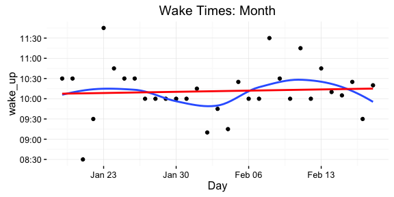

# Habits Report
Chris Riederer  
February 19, 2017  

## Intro
Report and visualize some data kept from my "Habits" spreadsheet.

## Meditation
Visualize trends in how much I'm meditating per day, and do counts of days when I meditate or not.

 days_meditated_this_year | n | percent 
--------------------------|---|---------
          FALSE           | 9 |0.1836735
           TRUE           |40 |0.8163265

 days_meditated_this_month | n | percent 
---------------------------|---|---------
           FALSE           | 6 |0.1935484
           TRUE            |25 |0.8064516

## Wake Times

## Exercise

 Exercise | year  | month  | week 
----------|------ | -------|------
   7min   |   4   |    0   |   0   
   bike   |   5   |    5   |   1   
   run    |   1   |    0   |   0   
 ultimate |   9   |    5   |   2   
   walk   |   2   |    2   |   0   

